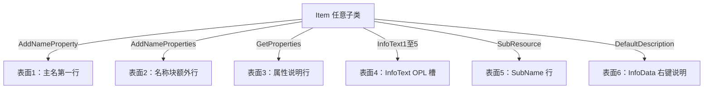

# 待中文化物品清单

> **更新日期：** 2026-05-19（**§7 T1/T2、§9.7 T-SS1–T-SS5、§9.8 T-SS-ES1–5、§9.9 Magical 主名、§9.10 模块清单 全部落地**；仅剩 `DefaultLocal.cs` 聊天 UI 及 `BaseCreature`/`BlackKnight`/`BaronAlmric` 等 Mobile 战利品 InfoText 需运行时 loot 解析的深层工单—二者已记录待后续覆盖）
> **说明：** 本文档记录已完成中文化的装备属性系统之外，尚未开始中文化的物品类别。用于后续任务参考和范围规划。

---

## 目录

1. [SendMessage 与中文字符串（AI 流水线）](#sendmessage--中文字符串ai-流水线)
2. [物品名称中文化（OPL 主名）](#物品名称中文化)
3. [任务（待办）：硬编码 SendMessage / Say 全库清查](#任务待办硬编码-sendmessage--say-全库清查)
4. [已完成中文化的装备基类](#1-已完成中文化的装备基类)
5. [已修复的装备子类未保护 cliloc](#2-已修复的装备子类未保护-cliloc)
6. [Phase 3：Gift 附魔系统（已完成）](#3-phase-3gift-附魔系统已完成)
7. [Phase 4：Level 经验装备系统（已完成）](#4-phase-4level-经验装备系统已完成)
8. [待后续中文化的非装备物品](#5-待后续中文化的非装备物品)
9. [附录：非装备物品分类总表](#6-附录非装备物品分类总表)
10. [§5.3b Trades：工单（头顶 / Gump / 叙事 / OPL）](#53b-trades-tickets-overhead-gump-narrative-opl)
11. [§7 物品 OPL 名称扫描工单（T1–T7）](#7-物品-opl-名称扫描工单2026-05-17)
12. [§8 装备 OPL 主名、装备槽位、乐器与书本（根因 + 工单）](#8-equipment-opl-name-layer-books-instruments)
13. [§9 OPL Tooltip 全文稽核方法论（T8–T20、T-B2-QA、T-SS）](#9-opl-tooltip-全文稽核方法论t8t20t-b2-qat-ss) · [§9.10 扫描工单草案（模块清单）](#910-扫描工单草案2026-05-18--模块清单)

---

## SendMessage 与中文字符串（AI 流水线）

适用于 **`Mobile.SendMessage` / `Say` 等**仍硬编码英文、且**未**走 `SendLocalizedMessage(cliloc)` 的脚本（例如魔法物品使用失败提示）。

**首选：shotkey（逻辑键）** — 与 `trap.*`、`prop.*` 一样，在 **`en/` + `zh-Hans/` 同一对手写 JSON**（如 `equipment-properties.json`）中增加键值，代码使用 **`StringCatalog.ResolveByKey` / `ResolveFormatByKey`**。不跑提取器生成 `s.` 哈希键，键名须稳定、可读。

| 步骤 | 动作（shotkey） |
|------|------------------|
| 1 | 设计稳定键名（例：`prop.magical.moonstone.gate.inert`，与同类 `prop.magical.*` 同文件） |
| 2 | 在 `World/Data/Localization/en/<bundle>.json` 与 `zh-Hans/<bundle>.json` 写入同一键；`bundle` 须在 `AGENTS.md` §3.1 `keep_extra` 列表中 |
| 3 | `using Server.Localization;`，`SendMessage(StringCatalog.ResolveByKey(from.Account, "your.logical.key"))` |
| 4 | `sync_localization_glossary.py --check`（若文案含词表专有名词） |

**备选：哈希键** — `StringCatalog.Resolve(from.Account, "Exact English…")`，再执行 `build_localization_strings.py --no-translate`，对新生成的 `s.` 行做 §3.4 翻译。

| 步骤 | 动作（哈希） |
|------|----------------|
| 1 | `using Server.Localization;`，`SendMessage(StringCatalog.Resolve(from.Account, "..."))` |
| 2 | 仓库根目录 `python3 World/Source/Tools/build_localization_strings.py --no-translate` |
| 3 | 在对应 `en/scripts-*.json` 确认新 `s.` 键 |
| 4 | `llm_incremental_locale.py` queue → LLM → `apply` → `sync_localization_glossary.py --check` |

**注意：** 提取器只扫描 **`Resolve` / `ResolveFormat` 里的英文字面量**；shotkey 全部由手写 JSON 维护。约定见根目录 **`AGENTS.md` §3.2**。

**示例：** `Items/Magical/Moonstone.cs` — 月门石无法开启时使用 **`prop.magical.moonstone.gate.inert`** + `ResolveByKey`（文案在 `equipment-properties.json`）。

**色相（hue）与 `SendMessage(int hue, string)`：** 第一个参数仅为客户端着色（例如 **68** 表示成功提示类色调）。**第二参数字符串仍须完全目录化**，不可为中文账号拼接 `"英文片段 " + 变量`。应使用 **`ResolveFormatByKey`** 与 **子串 shotkey**（如投掷手套/弹药类型名），使 **zh-Hans** 整句符合中文语序。详见根目录 **`AGENTS.md` §3.2** 「Tinted SendMessage」。

---

## 物品名称中文化

**目标：** 账号语言为 **zh-Hans** 时，**对象属性列表（OPL）第一行**显示中文**物品名**（及可选著色，若该 shotkey 在 `Item.PropertyColorMap` 中有映射）。与 **`SendMessage` / `Say`** 的文案是两套键：物品名用 **`item.*`**，属性行与交互提示多用 **`prop.*`**，均可在同一文件 **`equipment-properties.json`** 中维护。

**适用范围（当前实现）：**

- ✅ **OPL 主名**：覆盖 **`AddNameProperty`**，在 **`BuildingPropertyListLocale != null`**（由 **`IsContentLocalized`** + **`GetLocalizedPropertyList`** 链触发）时输出目录化字符串。
- ⚠️ **未包含**：地面 **`OnSingleClick`**、纯客户端 **`LabelNumber`** 工具提示等通路仍可能显示英文 **`Name`**；若需一律中文，须在对应 API 上另做 **`StringCatalog`** / 重载。

**数据文件：**

- 英文：`World/Data/Localization/en/equipment-properties.json`
- 简体中文：`World/Data/Localization/zh-Hans/equipment-properties.json`  
- 键名约定：**`item.magical.*`**（魔法类）、 **`item.special.*`**（Special / 契约等）；**勿与 `prop.*` 混用同一键**（职责分离，便于检索）。

**实现步骤（AI / 人工均可照表执行）：**

| # | 动作 |
|---|------|
| 1 | 类已 **`IsContentLocalized => true`**（与现有双语 OPL 一致）。 |
| 2 | 在 **`en/` + `zh-Hans/`** `equipment-properties.json` 增加成对 **`item....`** 键；**zh-Hans** 专有名词 **`中文（English）` 行内注**（`AGENTS.md` §3.5）。 |
| 3 | **`public override void AddNameProperty(ObjectPropertyList list)`**：若 **`BuildingPropertyListLocale != null`**，单件 **`AddLocalizedProperty(list, "item....")`**；多件 **`list.Add(1050039, "{0}\t{1}", Amount, ResolvePropertyText("item...."))`**；否则 **`base.AddNameProperty(list)`**。 |
| 4 | **保留** 构造器里的 **`Name = "…"`**（及 **`LabelNumber`**）供序列化、脚本、**`switch (Name)`**；仅 **展示层**走 **`item.*`**。 |
| 5 | 父类已覆盖 **`AddNameProperty`**（例如 **`BaseTrinket`** 的 exceptional / resource 格式）时，子类须在 **`return`** 前给出双语分支（例：**`OrbOfTheAbyss`**），避免丢格式。 |
| 6 | **`python3 World/Source/Tools/sync_localization_glossary.py --check`**（文案触碰词表时）。 |

**代码参考（先例）：**

| 模式 | 文件 / 类 |
|------|------------|
| 逻辑键 + 多形态 `Name` | `Items/Magical/RuneOfVirtue.cs` |
| `CraftResource` 动态名 | `Items/Trades/Special.cs`（`BaseSpecial`） |
| Special + 深渊五态 + 契约 | 见本文 **§5.2**（**`item.special.*`** / **`item.magical.moonstone.name`**） |

**根目录规范：** **`AGENTS.md` §3.1**（`equipment-properties` 含 **`item.*`**）、**§3.2**（`AddNameProperty` 段落）。**Tooltip / OPL 六表面检测与工单（T8–T20、T-SS）：** **`waiting-localization.md`** **§9**。

---

## 任务（待办）：硬编码 SendMessage / Say 全库清查

**目标：** 在 `World/Source` 内检索所有 **`Mobile.SendMessage` / `Say` / `SendAsciiMessage`** 等仍为**硬编码英文字符串**、且**未**经过以下任一方式的玩家可见文案：

- `StringCatalog.ResolveByKey` / `ResolveFormatByKey`（shotkey）
- `StringCatalog.Resolve` / `ResolveFormat`（哈希键，已由提取器管理）
- `SendLocalizedMessage` / CliLoc 编号

并逐项改为 **shotkey（优先）** 或哈希 **`Resolve`** 流水线，补全 `zh-Hans`。

**建议检索（示例）：**

- `SendMessage\s*\(\s*"`
- `Say\s*\(\s*"`（排除已包裹 `StringCatalog` 的行）
- `SendAsciiMessage\s*\(\s*"`

**优先级建议：** 高频物品/技能失败提示 → 任务与副本提示 → 低频装饰文案。

**完成标准：** 玩家语言为 zh-Hans 时不应再出现未目录化的英文 `SendMessage` 句（允许 CliLoc 英服原文由客户端语言处理的情况除外）。

---

## 1. 已完成中文化的装备基类

以下装备基类已启用 `IsContentLocalized => true` 并使用 `AddLocalizedProperty` 双语 OPL 模式：

| # | Class | 源文件 | 状态 |
|---|-------|--------|------|
| 1 | `BaseWeapon` | `Items/Weapons/BaseWeapon.cs` | ✅ 已完成 |
| 2 | `BaseArmor` | `Items/Armor/BaseArmor.cs` | ✅ 已完成 |
| 3 | `BaseClothing` | `Items/Clothing/BaseClothing.cs` | ✅ 已完成 |
| 4 | `BaseTrinket` | `Items/Trinkets/BaseTrinket.cs` | ✅ 已完成 |
| 5 | `BaseInstrument` | `Items/Instruments/BaseInstrument.cs` | ✅ 已完成 |
| 6 | `BaseQuiver` | `Items/Quivers/BaseQuiver.cs` | ✅ 已完成 |
| 7 | `BaseHarvestTool` | `Items/Trades/BaseHarvestTool.cs` | ✅ 已完成 |
| 8 | `BaseTool` | `Items/Trades/BaseTool.cs` | ✅ 已完成 |
| 9 | `BaseSpecial` | `Items/Trades/Special.cs` | ✅ 已完成 |

---

## 2. 已修复的装备子类未保护 cliloc

以下类继承自已本地化的基类，但有额外的 `GetProperties` 覆盖使用无保护的 cliloc。已通过判断 `BuildingPropertyListLocale` 修复：

| # | 文件 | Class | 修复内容 |
|---|------|-------|---------|
| 1 | `Items/Weapons/BaseWeapon.cs` | `BaseWeapon` | 毒药（1062412+level）、装备层（1061182）、密度（1061182+Density）3处 |
| 2 | `Items/Armor/Leather/LeatherGloves.cs` | `LeatherGloves` | 奥术充能（1061837） |
| 3 | `Items/Clothing/Cloaks.cs` | `Cloak` | 奥术充能（1061837） |
| 4 | `Items/Clothing/OuterTorso.cs` | `Robe` | 奥术充能（1061837） |
| 5 | `Items/Clothing/Shoes.cs` | `ThighBoots` | 奥术充能（1061837） |

---

## 3. Phase 3：Gift 附魔系统（已完成）

Gift 系统是装备的扩展，为物品添加附魔点数和可自定义附魔功能。Gift 装备的基类定义在 `Items/Magical/Gift/` 中，具体装备类继承自 Gift 基类（位于对应装备目录）。

### 3.1 Gift 基类（13个）

| # | 文件 | 显示文本 | 类型 |
|---|------|---------|------|
| 1 | `Magical/Gift/BaseGiftClothing.cs` | "附魔"、"附魔点数"、"拥有者" | 衣物 |
| 2 | `Magical/Gift/BaseGiftShield.cs` | 同上 | 盾牌 |
| 3 | `Magical/Gift/BaseGiftJewel.cs` | 同上 | 饰品 |
| 4 | `Magical/Gift/BaseGiftArmor.cs` | 同上 | 护甲 |
| 5 | `Magical/Gift/BaseGiftStaff.cs` | 同上 | 法杖 |
| 6 | `Magical/Gift/BaseGiftBashing.cs` | 同上 | 钝器 |
| 7 | `Magical/Gift/BaseGiftWhip.cs` | 同上 | 鞭 |
| 8 | `Magical/Gift/BaseGiftAxe.cs` | 同上 | 斧 |
| 9 | `Magical/Gift/BaseGiftKnife.cs` | 同上 | 匕首 |
| 10 | `Magical/Gift/BaseGiftSword.cs` | 同上 | 剑 |
| 11 | `Magical/Gift/BaseGiftRanged.cs` | 同上 | 远程 |
| 12 | `Magical/Gift/BaseGiftSpear.cs` | 同上 | 矛 |
| 13 | `Magical/Gift/BaseGiftPoleArm.cs` | 同上 | 长柄 |

### 3.2 Gift 子类的额外属性

| # | 文件 | 额外文本 | 
|---|------|---------|
| 14 | `Magical/Gift/GiftCloaks.cs` | 奥术充能 |
| 15 | `Magical/Gift/GiftShoes.cs` | 奥术充能 |
| 16 | `Magical/Gift/GiftOuterTorso.cs` | 奥术充能 |
| 17 | `Magical/Gift/GiftLeatherGloves.cs` | 奥术充能 |
| 18 | `Magical/Gift/GiftThrowingGloves.cs` | "双击更改类型"、"无法与其他武器共用" |
| 19 | `Magical/Gift/GiftPugilistMits.cs` | "无法与其他武器共用" |

### 3.3 Gift / Level 运行时文案（SendMessage / 类内 Gump）

附魔与等级系统的 **OPL**（`gift.*` / `god.*`）此前已接入；**玩家消息** 与 **铁匠验证 Gump** 已统一为 `equipment-properties.json` 中的 **`god.msg.*`、`god.gump.levelup.*`**，代码使用 `StringCatalog.ResolveByKey` / `ResolveFormatByKey`。经验代币 **OPL 主名** 使用 **`item.god.exp.token.name`**。Gift/Level 共用 **`god.msg.attr.not.enough.points`**（附魔与升级加点均不足时）。**礼品提灯（Gift Lantern）** 已 `IsContentLocalized` 并补 **`god.lantern.*`** 与 Level 提灯一致。

---

## 4. Phase 4：Level 经验装备系统（已完成）

Level/God 系统为装备添加等级和经验值属性。基类定义在 `Items/Magical/God/` 中。

### 4.1 Level 基类（13个）

| # | 文件 | 显示文本 |
|---|------|---------|
| 1 | `Magical/God/BaseLevelClothing.cs` | "等级"、"经验值" |
| 2 | `Magical/God/BaseLevelShield.cs` | 同上 |
| 3 | `Magical/God/BaseLevelJewel.cs` | 同上 |
| 4 | `Magical/God/BaseLevelArmor.cs` | 同上 |
| 5 | `Magical/God/BaseLevelStaff.cs` | 同上 |
| 6 | `Magical/God/BaseLevelBashing.cs` | 同上 |
| 7 | `Magical/God/BaseLevelWhip.cs` | 同上 |
| 8 | `Magical/God/BaseLevelAxe.cs` | 同上 |
| 9 | `Magical/God/BaseLevelKnife.cs` | 同上 |
| 10 | `Magical/God/BaseLevelSword.cs` | 同上 |
| 11 | `Magical/God/BaseLevelRanged.cs` | 同上 |
| 12 | `Magical/God/BaseLevelSpear.cs` | 同上 |
| 13 | `Magical/God/BaseLevelPoleArm.cs` | 同上 |

### 4.2 Level 子类的额外属性

| # | 文件 | 额外文本 |
|---|------|---------|
| 14 | `Magical/God/LevelCloaks.cs` | 奥术充能 |
| 15 | `Magical/God/LevelShoes.cs` | 奥术充能 |
| 16 | `Magical/God/LevelOuterTorso.cs` | 奥术充能 |
| 17 | `Magical/God/LevelLeatherGloves.cs` | 奥术充能 |
| 18 | `Magical/God/LevelThrowingGloves.cs` | "双击更改类型"、"无法与其他武器共用" |
| 19 | `Magical/God/LevelPugilistMits.cs` | "无法与其他武器共用" |

### 4.3 Level 系统其他物品

| # | 文件 | 显示文本 |
|---|------|---------|
| 20 | `Magical/God/LevelUpScroll.cs` | "神奇强化符文（+{0} 最大等级）"、"崇高符文..."、"神圣符文..." |
| 21 | `Magical/God/LegendaryArtifactRename.cs` | "{0} 次使用剩余"、"重命名传说神器"、"属于..." |
| 22 | `Magical/God/MagicCandle.cs` | "双击装备/卸下" |
| 23 | `Magical/God/MagicLantern.cs` | "双击装备/卸下" |
| 24 | `Magical/God/MagicTorch.cs` | "双击装备/卸下" |
| 25 | `Magical/God/ItemExperienceToken.cs` | "经验值" |

---

## 5. 待后续中文化的非装备物品

以下物品直接继承 `Item`（而非装备基类），不参与装备 OPL 属性系统。它们通过 `AddNameProperties` 展示描述性文本，需要对每一条消息单独进行中文化包装。

这些物品分为几类，分别有不同的中文化策略。

### 5.1 Magical 目录 - 魔法物品（18个文件）（完成）

**运行时 `SendMessage`：** `SoulOrb`、`LuckyHorseShoes`、`SlayerDeed`、`ArtifactManual`、`ManualOfItems`、`ColoringBook`、`GemOfSeeing` 等已改用 **`prop.magical.*.msg.*`** / **`god.msg.*`**（与既有 `prop.magical.*` OPL 键并列，均在 `equipment-properties.json`）。屠魔契 **`prop.magical.slayer.msg.*`** 并修正英文第二槽提示为 “Your weapon …”（原 `You weapon` 笔误）。

**OPL 主名（第一行）：** 若干类仍缺 **`DisplayNameLocalizationKey`** / 动态名双语分支，见 **§9.9 T-SS5**；**`ManualOfItems`** 遗物箱主名单列 **§9.7 T-SS3**。**Spellbook / SongBook** 歌曲数量行见 **§9.7 T-SS2**。

| # | 文件 | Class | 英文文本 |
|---|------|-------|---------|
| 1 | `Items/Magical/SoulOrb.cs` | `SoulOrb` | "Contains vampire blood for..."、"Contains genetic patterns for..."、"Contains the Soul of..." |
| 2 | `Items/Magical/LuckyHorseShoes.cs` | `LuckyHorseShoes` | "Adds up to 100 Luck To An Item" |
| 3 | `Items/Magical/RuneOfVirtue.cs` | `RuneOfVirtue` | "Rune for..." |
| 4 | `Items/Magical/Moonstone.cs` | `MoonStone` | **主名** `item.magical.moonstone.name`；OPL：`prop.magical.moonstone`；使用失败：`prop.magical.moonstone.gate.inert` + `ResolveByKey` |
| 5 | `Items/Magical/SlayerDeed.cs` | `SlayerDeed` | 屠魔种类名称 |
| 6 | `Items/Magical/ArtifactManual.cs` | `ArtifactManual` | "This Identifies Items"、使用次数 |
| 7 | `Items/Magical/ManualOfItems.cs` | `ManualOfItems` | 使用次数、"Belongs to..."；**遗物箱 Gump** 标题/说明 **`god.gump.relicchest.*`**；列表行 **`god.legendbook.row.*`**（`zh-Hans/legend-book-rows.json`）；领取提示 **`god.msg.relic.chest.received`** |
| 8 | `Items/Magical/StaffOfFiveParts.cs` | `Part1`-`Part5` | "Belongs to..."（5处） |
| 9 | `Items/Magical/GemOfSeeing.cs` | `GemOfSeeing` | "Find Hidden Items And Traps"、使用次数 |
| 10 | `Items/Magical/PandorasBox.cs` | `PandorasBox` | "Magically Access Your Bank Box"、使用次数 |
| 11 | `Items/Magical/ColoringBook.cs` | `ColoringBook` | 颜色名称字符串 |
| 12 | `Items/Magical/Arcane/` | 4个元素书 | "...Book of Spells" |
| 13 | `Items/Magical/RuneOfVirtue.cs` | `RuneOfVirtue` | 符文类型描述 |

### 5.1b Magical/Artifacts 子目录神器（`SendMessage` 已改为 shotkey）

以下文件玩家提示已改为 **`prop.magical.artifact.*`**（`equipment-properties.json`）：`Artifact_StaffofSnakes`、`Artifact_GandalfsStaff`、`Artifact_HammerofThor`、`Artifact_HelmOfBrilliance`、`Artifact_RobeOfTeleportation`、`Artifact_AcidProofRobe`、`Artifact_RodOfResurrection`、`EverlastingLoaf`、`EverlastingBottle`。

### 5.2 Special 目录 - 特殊物品（5 + 8 契约 `.cs`）（部分完成）

| # | 文件 | Class | 策略 |
|---|------|-------|------|
| 1 | `Items/Special/SlaversNet.cs` | `SlaversNet` | `IsContentLocalized`；**主名** `item.special.slaversnet`；OPL `prop.special.slaversnet.capture.tamable`；`SendMessage`：`ResolveByKey` / `ResolveFormatByKey` |
| 2 | `Items/Special/OrbOfTheAbyss.cs` | `OrbOfTheAbyss` | **主名** `item.special.abyss.*`（五态）；OPL `prop.special.orbabyss.belongs`；装备 `prop.special.orbabyss.not.yours`；`ChangeOrb` `prop.special.orbabyss.tinker.give` |
| 3 | `Items/Special/AlternateRealityMap.cs` | `AlternateRealityMap` | **主名** `item.special.altmap`；OPL `prop.special.altmap.examine` |
| 4 | `Items/Special/SoulStone.cs` | `SoulStone` / `SoulstoneFragment` | **主名** `item.special.soulstone` / `item.special.soulstone.fragment`（默认无 `Name`）；`GetProperties`：`prop.special.soulstone.*`、碎片 `prop.special.soulstonefragment.uses.*`；`prop.special.soulstone.msg.absorb.explode` |
| 5 | `Items/Special/DragonPedStatue.cs` | `DragonPedStatue` | **主名** `item.special.dragon.statue`；材质 `prop.special.dragonstatue.material`；刻名 `prop.special.dragonstatue.inscription` |
| 6 | `Broken Furniture Collection/*.cs` | 8× `*Deed` | **主名** `item.special.deed.broken.*`；放置说明 `prop.special.brokenfurniture.place.in.home` |

**复查（2026-05-17）：** `Items/Special/Rares/PaganReagents/*.cs` 拾取提示已改为 **`prop.special.paganreagent.decorative.*`**。`BarbaricSatchel`、`DemonPrison`（含献金成功 **`prop.special.demonprison.gold.added`**）、`DragonEgg` / `DrakkhenEgg` / `DracolichSkull`（金币反馈 **`prop.special.egg.gold.added`**）、`HugeWaterTub` 等玩家 **`SendMessage`** 已走 **`StringCatalog.Resolve*`** 与 `equipment-properties.json`。其它 `Special/Rares` 若新增脚本，请用 `SendMessage( StringCatalog.` 检索复核。

### 5.3 Trades 目录 - 交易技能物品（运行时消息已收敛）

**复查（2026-05-17）：** `Scripts/Items/Trades/` 下列路径的玩家 **`SendMessage`** 已改为 **`ResolveByKey` / `ResolveFormatByKey`**（键在 **`equipment-properties.json`**）：`Blacksmithing/DwarvenForge`、`Fishing/*Barrel`、`Lumberjack/Log`（含锯木失败）、`Misc/Bandage`（祝福不可用、随从未死、饥肠治疗拒绝、**`EnableHealingLogging`** 调试行）、`Magical/Moongate`、`Glass Stone/*Book`（玻璃吹制 / 石工 / 采石 / 采沙）、`Tailoring/SpoolOfThread`（织机未完成布 / 材料不足）、`Thieving/DisguiseKit`、`LockPick`、`Sextant`、`PickBox`、`Clocks`、`Ore`、`MagicFish`、`Dyes` 等。新增 trades 物品请勿再写字面量英文 **`SendMessage("...")`**。

| 子目录 | 文件 | 策略摘要 |
|--------|------|----------|
| **Blacksmithing/** | `FireGiantForge.cs`、`RubyPickaxe.cs` | 已完成 |
| **Bowcraft/** | `ArrowsAndBolts.cs`（四类 Bundle） | `IsContentLocalized`；主名与 OPL `prop.trade.bow.*`；消息与头顶 `StringCatalog` |
| **Fishing/** | 渔获/渔网/deed/沉船等 | 已完成 |
| **Carpentry/** | `TaxidermyKit.cs` | 已完成 |
| **Thieving/** | 骷髅钥匙三文件 | 已完成 |
| **Forensics/** | `PolishBoneBrush.cs` | 已完成 |
| **Reagents/** | `GoldenFeathers.cs`、`Reagents.cs` | 已完成 |
| **Cartography/** | `MapRanger.cs`、`MapRangerDoor`、`LocalMap`、`WorldMap`、`CityMap`、`SeaChart`、`TreasureMap` | `IsContentLocalized`；`GetProperties` / `SendMessage` 走 `StringCatalog` / `ResolvePropertyText` |
| **Alchemy/** | `AlchemyTub.cs`、`CrystallineJar.cs` | 已完成 |
| **Ninjitsu/** | `Shuriken`、`FukiyaDarts`、`Fukiya`、`LeatherNinjaBelt` | `NinjaAmmoOplProperties`（`NinjaWeapons.cs`）；毒药与次数 OPL；腰带装备提示键 |

<a id="53b-trades-tickets-overhead-gump-narrative-opl"></a>

### 5.3b Trades tickets（头顶 / Gump / 叙事 / OPL 面）

> **来源：** 2026-05-17 对 `Scripts/Items/Trades/` 全目录复查：`SendMessage("` 与 `.Say("` 已无硬编码英文；下列为 **仍非 `StringCatalog`、玩家可能看到英文** 的条目，需单独开单处理。

| 优先级 | 子类 | 文件（路径相对 `Scripts/Items/Trades/`） | 现状与建议 |
|--------|------|------------------------------------------|------------|
| P1 | 开锁过程头顶 | `Thieving/LockPick.cs` | **已完成（2026-05-17）：** **`prop.trade.lockpick.overhead.*`**（`equipment-properties.json`），`PrivateOverheadMessage` 走 **`StringCatalog.ResolveByKey(from.Account, …)`**；宝箱 **`PublicOverheadMessage`** 按客户端语言 **`TryResolveByKey`** 广播（逻辑键无法走 `Item.PublicOverheadMessage` 的英文哈希解析）。开锁器 **`InfoDataGump`**：`lockpick.normal` / `lockpick.tech`。 |
| P2 | 月门确认 Gump | `Magical/Moongate.cs` | **已完成（2026-05-17）：** `!Core.AOS` 分支主提示改为 **`AddHtmlLocalized(..., 1062049, 32512, ...)`**，与 AOS 同级 cliloc 一致。 |
| P0 | SOS 沉船求救全文 | `Fishing/Misc/SOS.cs` | **已完成（2026-05-17）：** 新掉落使用 **`save version 6` + 结构化字段**（模板 0–4、异怪 0–11、同伴、城市、幸存人数）；打开 gump 时按账号语言 **`StringCatalog.ResolveFormatByKey`** 拼 **`prop.trade.sos.story.*` / `prop.trade.sos.beast.*` / `prop.trade.sos.prefix.ancient`**；坐标行 **`prop.trade.sos.coords.fmt`**（中文用全角逗号与分 **′**）。**旧存档**仍读 `ShipStory` 英文 + `QuestCompositeResolver`。GM 用 `Ship_Story` 覆盖会 **`m_StructuredStory = false`** 退回旧通路。 |
| P2 | Speech gump 标题 | `Fishing/FishBarrel.cs`、`Fishing/ScrapIronBarrel.cs` | **已完成（2026-05-17）：** 标题 **`prop.trade.barrel.gump.title.fish` / `.scrap`**；正文 **`prop.trade.barrel.speech.aquarium` / `.scrapmetal`**（`Talk.cs` **`SpeechFunctions.SpeechText`** 分支走 **`StringCatalog.ResolveByKey`**）。 |
| P2 | 遗物钟名称 / OPL 金额 | `Tinkering/Clocks.cs` | **已完成（2026-05-17）：** 共享基类 **`DDRelicClockBase`**，`save version 2` 持久化 **`m_RelicClockAdjIndex`**；双语 OPL：**`prop.trade.relicclock.adj.0`…`18`**、**`prop.trade.relicclock.name.fmt`**、**`prop.trade.relicclock.worth`**；金额行经 **`Item.AddColorText3Property`** 钩子注入（见 `Item.cs`），位置与原 `ColorText3` 一致。 |
| P3 | 全目录 `DefaultDescription` / `DefaultName` / `Name =` | `Scripts/Items/Trades/` 下多文件 | **已完成（2026-05-17）：** `InfoDataGump` 经 **`InfoDataLocalizationKey`**（`prop.trade.itemdesc.*`）。**属性列表（OPL）显示名**：`Item.DisplayNameLocalizationKey`（`item.trade.name.*`）+ **`ShouldUseLocalizedOpl()`**（有显示名 shotkey 即走双语 OPL，不必每类再写 `IsContentLocalized`）。已覆盖 P3 批次静态名物品、五档练习箱、八类符文工具×三档、稀有试剂名、工艺书四本、六分仪等。**动态材料 / 桶名 / 地图（2026-05-17）：** `CraftResources.GetTradeItemFullName` 双语 OPL 经各 **`Base*` 资源类** 的 **`IsContentLocalized` + `CraftResources.AddLocalizedTradeCommodityNameProperty`**；后缀与格式键在 **`trade-commodity.json`**（`trade.suffix.*`、`trade.compose.material_suffix`、`trade.custom.*`），材料短名仍走 **`resource-harvest-extra`** 哈希；`PotionKeg` 使用 **`trade.keg.potion.*`**；`PlaceMap` 使用 **`m_TargetPlaceLabel` + `placemap-labels.json`**（地名哈希）及 **`placemap.name.format`**。`MapRanger` 描述仍为 **`prop.trade.mapranger.longdesc`**。 |

**复查命令（仅供执行人）：**

- `SendMessage\s*\(\s*"`、`\.Say\s*\(\s*"`：应为空。
- `PrivateOverheadMessage\s*\([^)]*"`、`PublicOverheadMessage\s*\([^)]*"`：先清 `LockPick.cs`，再全库扩展同一模式。

---

## 6. Quest

### 6.1 Major 目录
`/World/Source/Scripts/Engines and Systems/Quests/Major`

---

## 7. 物品 OPL 名称扫描工单（2026-05-17）

> **（2026-05-18）T3–T7 已落地：** T3 — `BaseRunicTool` 在材质前缀分支使用 `DisplayNameLocalizationKey` + `item.trade.name.magical.runic.*`；T4 — `CrystallineJar.AddNameProperty` 覆盖 `flask of holy water`、`flask of {substance}`（`item.trade.name.flask.*` + 物质名 `TryResolve`）；T5 — evil 装潢 deed、塔罗×9、花卉×5、`HugeWaterTub`、`MinotaurHedge`、`TormentedChains`、`WindSpirit`、`BloodyPentagramDeed` 等 `item.special.*`，`DragonOrbStatue` / `WizardsStatue` 用 `item.special.statue.of.fmt`；T7 — `MagicQuiver` 双语彩色首行（`prop.magical.magicquiver.name.line`、`item.magical.magicquiver.base`），`WeaponRenamingTool` 主名 + `prop.magical.weaponrename.msg.*`。下表 **状态列未必逐行更新**。

> **扫描方法：** 全库 `Name = "English..."` + `DisplayNameLocalizationKey` / `ShouldUseLocalizedOpl()` / `AddNameProperty` 覆盖状态检查，找出 zh-Hans 账号仍看到英文名的物品类别。
>
> **通用实现模式（无 AddNameProperty 的简单类）：**
> 1. 在类里加 `public override string DisplayNameLocalizationKey => "item.trade.name.XXX";`（或 `item.magical.*` / `item.special.*`）
> 2. 在 `en/equipment-properties.json` 与 `zh-Hans/equipment-properties.json` 各加同一键；zh 值按 §3.5 规范（专有名词 `中文（English）`）
> 3. `BaseTool` / `BaseHarvestTool` / `Item` 基类均已实现 `ShouldUseLocalizedOpl()`，无需额外覆盖 `IsContentLocalized` 或 `AddNameProperty`
>
> **注意：** 以下各工单中 `✅ 已覆盖` 标注代表已有 `DisplayNameLocalizationKey` 或等效覆盖，**仅供参考对比**；无标注的即为待处理项。

---

### T1 — 炼金 / 巫术 / 普通试剂名（~25 条）✅

**优先级：P1**（玩家背包常驻材料，高曝光）

> **全部完成**（2026-05-19）。24 个类已添加 `IsContentLocalized` + `DisplayNameLocalizationKey`（前缀 `item.trade.name.reagent.*`）；`Reagents.cs` 三 Jar 类也已完成。

| 文件（相对 `Scripts/Items/Trades/Reagents/`） | 英文 Name | 状态 |
|---|---|---|
| `Alchemy/MoonCrystal.cs` | `moon crystal` | ✅ |
| `Alchemy/SeaSalt.cs` | `sea salt` | ✅ |
| `Alchemy/ButterflyWings.cs` | `butterfly wings` | ✅ |
| `Alchemy/Brimstone.cs` | `brimstone` | ✅ |
| `Alchemy/SilverWidow.cs` | `silver widow` | ✅ |
| `Alchemy/GargoyleEar.cs` | `gargoyle ear` | ✅ |
| `Alchemy/EyeOfToad.cs` | `eye of toad` | ✅ |
| `Alchemy/FairyEgg.cs` | `fairy egg` | ✅ |
| `Alchemy/BeetleShell.cs` | `beetle shell` | ✅ |
| `Alchemy/SwampBerries.cs` | `swamp berries` | ✅ |
| `Alchemy/PixieSkull.cs` | `pixie skull` | ✅ |
| `Alchemy/RedLotus.cs` | `red lotus` | ✅ |
| `Witch/MummyWrap.cs` | `mummy wrap` | ✅ |
| `Witch/BlackSand.cs` | `black sand` | ✅ |
| `Witch/BloodRose.cs` | `blood rose` | ✅ |
| `Witch/Maggot.cs` | `maggot` | ✅ |
| `Witch/DriedToad.cs` | `dried toad` | ✅ |
| `Witch/Wolfsbane.cs` | `wolfsbane` | ✅ |
| `Witch/BitterRoot.cs` | `bitter root` | ✅ |
| `Witch/WerewolfClaw.cs` | `werewolf claw` | ✅ |
| `Witch/VioletFungus.cs` | `violet fungus` | ✅ |
| `Common/BlackPearl.cs` | `black pearl` | ✅ |
| `Reagents.cs` (`JarOfWizardReagents`) | `Jar of Wizard Reagents` | ✅ |
| `Reagents.cs` (`JarOfNecromancerReagents`) | `Jar of Necromancer Reagents` | ✅ |
| `Reagents.cs` (`JarOfAlchemicalReagents`) | `Jar of Alchemical Reagents` | ✅ |
| `Unique/GoldenFeathers.cs` | `golden feathers` | ✅ 已覆盖 |
| `Unique/DragonBlood.cs` 等 9 Unique | 各项 | ✅ 已覆盖 |

**键名建议：** `item.trade.name.reagent.moon.crystal`、`item.trade.name.reagent.sea.salt` … `item.trade.name.reagent.jar.wizard` 等，统一前缀 `item.trade.name.reagent.*`。

---

### T2 — 基础技能工具名（非符文类，~24 条）

**优先级：P1**（玩家日常使用的工具，高曝光）

> **全部完成**（2026-05-19）。`DisplayNameLocalizationKey` + `IsContentLocalized` 均已落地。

| 文件（相对 `Scripts/Items/Trades/`） | 英文 Name | 状态 |
|---|---|---|
| `Tailoring/SewingKit.cs` | `sewing kit` | ✅ |
| `Tailoring/StitchingTools.cs` | `stitching tools` | ✅ |
| `Tailoring/LeatherworkingTools.cs` | `tanning tools` | ✅ |
| `Carpentry/CarpenterTools.cs` | `carpenter tools` | ✅ |
| `Carpentry/WoodworkingTools.cs` | `woodworking tools` | ✅ |
| `Tinkering/TinkerTools.cs` | `tinker tools` | ✅ |
| `Blacksmithing/SmithHammer.cs` | `smith hammer` | ✅ |
| `Blacksmithing/LapidaryTools.cs` | `lapidary hammer` | ✅ |
| `Blacksmithing/ScalingTools.cs` | `scaling tools` | ✅ |
| `Blacksmithing/Spade.cs` | `shovel` | ✅ |
| `Blacksmithing/Pickaxe.cs` (gargoyle variant) | `gargoyle pickaxe` | ✅ |
| `Blacksmithing/RubyPickaxe.cs` | `adamantium pickaxe` | ✅ |
| `Inscription/ScribesPen.cs` | `scribe quill` | ✅ |
| `Inscription/TomeOfWands.cs` | `tome of wands` | ✅ |
| `Inscription/Monocle.cs` | `librarian set` | ✅ |
| `Glass Stone/Blowpipe.cs` | `blowpipe` | ✅ |
| `Glass Stone/MalletAndChisel.cs` | `mallet and chisel` | ✅ |
| `Cooking/CulinarySet.cs` | `culinary set` | ✅ |
| `Bowcraft/FletcherTools.cs` | `bowcrafting tools` | ✅ |
| `Bowcraft/Arrow.cs` | `arrow` | ✅ |
| `Bowcraft/Bolt.cs` | `bolt` | ✅ |
| `Bowcraft/Feather.cs` | `feather` | ✅ |
| `Bowcraft/Shaft.cs` | `shaft` | ✅ |
| `Forensics/UndertakerKit.cs` | `undertaker kit` | ✅ |
| `Forensics/GraveSpade.cs` | `grave shovel` | ✅ |
| `Forensics/Bones.cs` | `bones` | ✅ |
| `Alchemy/Jar.cs` | `jar` | ✅ |
| `Alchemy/ApothecaryVials.cs` | `apothecary set` | ✅ |
| `Alchemy/MortarPestle.cs` | `alchemy set` | ✅ |
| `Druid/DruidCauldron.cs` | `druid's cauldron` | ✅ |
| `Witch/WitchCauldron.cs` | `witch's cauldron` | ✅ |
| `Bowcraft/FletcherToolsRunic.cs` | `runic bowcrafting tools I/II/III` | ✅（三级分级键 `item.trade.name.runic.fletcher.tools.1/2/3`） |

**注：** `Bandage`、`FishingPole`、`Flax`、`Cotton`、`Wool`、`Scissors`、`SpoolOfThread` 已完成；`Arrow/Bolt` 为单件（区别于 `ArrowsAndBolts` Bundle，Bundle 已完成）。

**键名建议：** `item.trade.name.*`（与已有符文工具键同前缀）。

---

### T3 — Magical/Tools 魔法版兼容工具名（8 条）

**优先级：P2**（由铁匠/裁缝工作室产出，玩家使用频率中等）

> **全部完成**（2026-05-19）。`DisplayNameLocalizationKey` + `IsContentLocalized` 均已落地。

| 文件（相对 `Scripts/Items/Trades/Magical/Tools/`） | 英文 Name | 状态 |
|---|---|---|
| `RunicHammer.cs` | `smith hammer` | ✅ |
| `RunicFletching.cs` | `bowyer tools` | ✅ |
| `RunicSewingKit.cs` | `sewing kit` | ✅ |
| `RunicTinker.cs` | `tinker tools` | ✅ |
| `RunicSaw.cs` | `woodworking tools` | ✅ |
| `RunicLeatherKit.cs` | `tanning kit` | ✅ |
| `RunicUndertaker.cs` | `undertaker tools` | ✅ |
| `RunicScales.cs` | `scaling tools` | ✅ |

**键名建议：** `item.trade.name.magical.runic.*`（区别于技能特定符文工具的 `item.trade.name.runic.*`）。

---

### T4 — 炼金容器动态名（1 条，复杂）

**优先级：P2**

| 文件 | 情形 | 现状 |
|---|---|---|
| `Trades/Alchemy/CrystallineJar.cs` | `Name = "crystalline flask"` 状态 | ✅ 已有 `AddNameProperty` → `item.trade.crystalline.flask` |
| | `Name = "flask of " + iJar.Name`（装填后动态名）| ❌ 仍为拼接英文字符串 |
| | `Name = "flask of holy water"` | ❌ 仍为硬编码英文 |

**建议：** 为 `flask of holy water` 增加 `item.trade.name.flask.holy.water` 键；对 `flask of {substance}` 需引入 `item.trade.name.flask.of` 格式模板 + substance 名称子键（或直接在 `AddNameProperty` 中判断 Name 前缀走 `ResolveFormatByKey`）。可推迟至 P3。

---

### T5 — 特殊装饰物品名（~20 条）

**优先级：P3**（主要用于家居装饰，玩家检视时可见英文名）

| 分类 | 文件路径（相对 `Scripts/Items/Special/`） | 英文 Name（或模式） | 状态 |
|---|---|---|---|
| **Evil Home Decor 收纳盒** | `Evil Home Decor Collection/BoneTable.cs` | `box containing a table of bones` | ✅ |
| | `BoneThrone.cs` | `box containing a throne of bones` | ✅ |
| | `BoneCouch.cs` | `box containing a couch of bones` | ✅ |
| | `UnsettlingPortrait.cs` | `box containing an unsettling portrait` | ✅ |
| | `CreepyPortrait.cs` | `box containing a creepy portrait` | ✅ |
| | `DisturbingPortrait.cs` | `box containing a disturbing portrait` | ✅ |
| | `AwesomeDisturbingPortrait.cs` | `box containing a disturbing portrait` | ✅ |
| | `BedOfNails.cs` | `box containing a bed of nails` | ✅ |
| | `HauntedMirror.cs` | `box containing a haunted mirror` | ✅ |
| | `SacrificialAltar.cs` | `box containing a sacrificial altar` | ✅ |
| **塔罗牌** | `Rares/TarotCards/DecoTarot*.cs`（×9 文件） | `tarot cards`（同一名） | ❌ 需 1 个键 |
| **花卉** | `Rares/Flowers/DecoFlower*.cs`（×2 文件） | `white roses` | ✅ |
| | `Rares/Flowers/DecoRoseOfTrinsic*.cs`（×3 文件） | `velvet rose` | ✅ |
| **其他** | `Rares/Containers/HugeWaterTub.cs` | `huge tub of water` | ✅ |
| | `MinotaurHedge.cs` | （需核查） | ❓ |
| | `TormentedChains.cs` | （需核查） | ❓ |
| | `WindSpirit.cs` | （需核查） | ❓ |
| | `DragonOrbStatue.cs` | （需核查） | ❓ |
| | `WizardsStatue.cs` | （需核查） | ❓ |
| | `Special/Items/BloodyPentagram.cs` | （需核查） | ❓ |

**键名建议：** `item.special.decor.*`（装饰盒类），`item.special.rares.*`（稀有装饰）。

---

### T6 — 魔法神器名（Magical/Artifacts 全目录，~110 条）

**优先级：P2**（可掉落/收藏神器，玩家展示/交易时均可见英文名）

> **（2026-05-17 更新）** 本批 **`Magical/Artifacts`** 具体子类已由 **§8.3 Fix B2** 工具批次接入 **`DisplayNameLocalizationKey`**（键前缀 **`item.magical.artifact.*`**）及 **`equipment-properties.json`** 成对 EN/zh-Hans；下表仍列子目录与示例，便于人工抽查译名与专有名词格式。

**子目录及代表性示例：**

| 子目录 | 代表物品（英文 Name） | 文件数 |
|---|---|---|
| `Artifacts/Weapons/Swordsmanship/` | Excalibur, Cold Blood, Blade Dance … | ~10 |
| `Artifacts/Weapons/Axes/` | Zyronic Claw, Quell, Axe of the Minotaur … | ~5 |
| `Artifacts/Weapons/Bows/` | Frostbringer, Nox Bow, Bow of the Phoenix … | ~8 |
| `Artifacts/Weapons/Fencing/` | Fang of Ractus, Raed's Glory, The Taskmaster … | ~6 |
| `Artifacts/Weapons/Bludgeoning/` | Bonesmasher, Arctic Death Dealer … | ~5 |
| `Artifacts/Weapons/Staffs/` | Phantom Staff, Wrath of the Dryad … | ~3 |
| `Artifacts/Armor/` (多子目录) | Helm of Brilliance, Violet Courage … | ~35 |
| `Artifacts/Clothing/` | Robe of Teleportation, Crown of Tal'Keesh … | ~12 |
| `Artifacts/Jewelry/` | Bracelet of the Vile, Ring of Health … | ~8 |
| `Artifacts/Trinkets/` | Bloodwood Spirit, Shimmering Talisman … | ~3 |
| `Artifacts/Shields/` | Achilles Shield … | ~2 |
| `Artifacts/Quivers/` | Quiver of Ice, Quiver of Elements … | ~3 |
| `Artifacts/Books/` | Hydros Lexicon, Lithos Tome … | ~6 |
| `Artifacts/Instruments/` | Iolo's Lute, Gwenno's Harp … | ~2 |
| `Artifacts/Minor/` | Gem of Seeing, Pandora's Box, Everlasting Loaf … | ~5 ✅（部分 `IsContentLocalized` 已有 `item.*` 键） |
| `Artifacts/Offhands/` | Grim Reaper's Lantern, Candles … | ~3 |

**实现建议：** 批量添加 `item.magical.artifact.*` 键（使用神器英文名 PascalCase 派生），统一在 `equipment-properties.json` 中维护。可按子目录分批次完成，每批同步翻译。

---

### T7 — 魔法奎弓及武器重命名工具

**优先级：P3**

| 文件 | 英文 Name | 状态 |
|---|---|---|
| `Magical/MagicQuiver.cs` | `quiver` | ✅ |
| `Magical/WeaponRenamingTool.cs` | （需核查具体名） | ❓ |

---

<a id="8-equipment-opl-name-layer-books-instruments"></a>

## 8. 装备 OPL 主名、装备槽位、乐器与书本（根因 + 工单）(完成)

> **整理日期：** 2026-05-17（**A5 / B1b / BaseBook** 静态书标题哈希解析已更新）

> **背景：** zh-Hans 账号下，装备 **属性行** 已大量走 `StringCatalog`/`AddLocalizedProperty`，但 **OPL 第一行物品名**、**「装备位置」取值**、**乐器/书本主名** 仍常显示英文。本节记录 **根因** 与 **分步工单**（Fix A / B），与 **§7** 非装备 `item.trade.*` 扫描互补。

---

### 8.1 根因分析

| 现象 | 根因（代码要点） |
|------|------------------|
| **装备 OPL 主名为英文** | **`BaseWeapon` / `BaseArmor` / `BaseClothing` / `BaseInstrument`** 的 **`AddNameProperty`** 不检查 **`BuildingPropertyListLocale`**：在常见分支中直接 **`list.Add(LabelNumber)`**（客户端 cliloc，英文）或 **`list.Add(Name)`**（英文构造名）。与已本地化的 **`GetProperties`** 形成 **两套管道不一致**。 |
| **「装备位置：right hand」类英文** | （1）**`Item.EquipLayerName(Layer)`**（`System/Item.cs`）返回硬编码英文字符串（`"Right Hand"`、`"Left Hand"`、`"Boots"` …）。（2）**`BaseWeapon`** 已用 **`AddLocalizedProperty(list, "prop.equipped.at", EquipLayerName(Layer))`**，故标签已是中文（如 `prop.equipped.at` →「装备位置：{0}」），但 **`{0}` 仍为英文**。（3）**`BaseArmor` / `BaseClothing` / `BaseInstrument` / `BaseTool` / `BaseHarvestTool` / `Spellbook` 等** 仍 **`list.Add(1061182, EquipLayerName(Layer))`**，无 locale 分支时整行随客户端英文。 |
| **乐器主名为英文** | 与武器同构：`BaseInstrument.AddNameProperty` 直接 **`LabelNumber` / `Name`**，未接 **`DisplayNameLocalizationKey`** / 双语首行。 |
| **书本主名为英文** | **`BaseBook.AddNameProperty`**：有标题时 **`list.Add(m_Title)`**，标题多为脚本构造器中的英文字符串；无标题时走 **`base.AddNameProperty`**，仍可能 cliloc/英文名。 |

**落实情况（2026-05-17）：**

- **上表第 2 行（装备槽位取值英文）：已按 §8.2 Fix A 落地。** 实现 **`Item.EquipLayerKey(Layer)`**（返回 `prop.layer.*` shotkey）、**`Item.AddEquipLayerProperty(ObjectPropertyList)`**（`BuildingPropertyListLocale != null` 时用 **`ResolvePropertyText(EquipLayerKey)`** 作为 **`prop.equipped.at`** 的 `{0}`；否则仍 **`1061182` + `EquipLayerName`**）。已在 **`en/` / `zh-Hans/equipment-properties.json`** 增加 **`prop.layer.right.hand` … `prop.layer.trinket`** 等条目。替换呼叫点的类型包括：**`BaseWeapon`、`BaseArmor`、`BaseClothing`、`BaseInstrument`、`BaseTrinket`、`BaseTool`、`BaseHarvestTool`、`BaseQuiver`、`Spellbook`（`Layer == Trinket`）、`MagicRuneBag`、`BaseEquipableLight`**。  
- **上表第 1、3、4 行：** **Fix B1 / B1b 已落地** — `Item.TryAddLocalizedDisplayNameProperty`（无材质时单一类型名；有材质 / exceptional 时由各 **`Base*`** 传入 **`CraftResources.GetDisplayNameLocalized`** 与 **`GetClilocLowerCaseName` 判定**，复合首行走 **`prop.item.opl.firstline.*`**）。**`BaseWeapon`** 首行不含 exceptional（与 vanilla 一致）、早退后仍处理镌刻 **`1062613`**。**`BaseBook`**：非自写书且双语 OPL 时标题走 **`StringCatalog.TryResolve(BuildingPropertyListLocale, m_Title)`**（与 extractor 哈希表一致；自写书标题不强制目录化）。玩家可见中文主名仍依赖 **Fix B2** 为各类物品配置 **`item.*` 键**。

**范围说明：**

- **玩家自写书**（`Writable`、标题为玩家输入）：不应强行目录化标题；可仅处理 **无标题默认** / **系统静态书**。
- **神器/自定义 `Name`**：与 §7.T6 一致，需 per-class **`DisplayNameLocalizationKey`** + **`equipment-properties.json`**。

---

### 8.2 工单 Fix A — 装备槽位字符串目录化（优先 P1）

> **状态（2026-05-17）：** A1–A5 已落地。**A5** — `ItemProps.ItemProperties` 三参重载接受 **`IAccount`**，**`Equipment:`** 行走 **`prop.itemprops.equipment.line`** + **`Item.GetEquipLayerLabelForAccount`**；**`BlackMarket` / `CraftSystem.SetDescription`** 传入玩家 **`Account`**。

**目标：** 任意走 **`prop.equipped.at`** 或等价属性的行，**`{0}` 为中文槽位名**；未做 locale 分支的基类改为与 **`BaseWeapon`** 一致的 **`AddLocalizedProperty`** 模式。

| # | 动作 | 文件 / 数据 |
|---|------|-------------|
| A1 | 新增 **稳定键生成**：例如 **`Item.EquipLayerKey(Layer)`** → `"prop.layer.right.hand"` 等（与 `EquipLayerName` 分支一一对应，返回 shotkey 而非英文）。 | `World/Source/System/Item.cs` |
| A2 | 在 **`en/`、`zh-Hans/equipment-properties.json`** 各增 **`prop.layer.*`**（约 12 条：右手、左手、双手、靴、腿、胸、头等 —— 与现有 `EquipLayerName` 返回值一一对照）。 | `World/Data/Localization/en|zh-Hans/equipment-properties.json` |
| A3 | **`BaseWeapon`**：将 **`AddLocalizedProperty(..., "prop.equipped.at", EquipLayerName(Layer))`** 改为第二参使用 **`ResolvePropertyText(EquipLayerKey(Layer))`**（或等效 API，确保 `{0}` 已解析为 zh）。 | `World/Source/Scripts/Items/Weapons/BaseWeapon.cs` |
| A4 | **`BaseArmor`、`BaseClothing`、`BaseInstrument`、`BaseTool`、`BaseHarvestTool`** 及 **`Spellbook`、可穿戴灯、符文袋等** 凡 **`list.Add(1061182, EquipLayerName(...))`** 之处：在 **`BuildingPropertyListLocale != null`** 时改为 **`AddLocalizedProperty(list, "prop.equipped.at", ResolvePropertyText(EquipLayerKey(Layer)))`**。 | 各对应 `.cs`（可用 `rg "1061182, EquipLayerName"` 全库清点） |
| A5 | **`ItemProperties.cs`** 等若拼接 `"Equipment: " + EquipLayerName`** 的 **网页/调试 HTML**，视需要同样走目录化（低优先，避免与游戏内 OPL 不一致）。 | `World/Source/Scripts/System/Misc/ItemProperties.cs`（可选） |

**完成标准：** zh-Hans 下 OPL 不出现 **`Right Hand` / `Left Hand`** 等裸英文槽位；英文服行为不变。

---

### 8.3 工单 Fix B — 装备 / 乐器 / 静态书本 **OPL 第一行** 目录化

**Fix B1 — 基类闸门（P1，改动面小、应先落地）**

> **状态（2026-05-17）：** **`Item.TryAddLocalizedDisplayNameProperty`** 含 **B1b** 重载（材质 / exceptional 复合首行）；**`BaseWeapon`**（早退后仍处理 **`m_EngravedText`**）、**`BaseArmor`、`BaseClothing`、`BaseInstrument`、`BaseTrinket`** 在 **`AddNameProperty`** 开头调用。**`BaseBook`** 静态书标题见下文与 §8.1「落实情况」。

| # | 动作 | 说明 |
|---|------|------|
| B1.1 | **`TryAddLocalizedDisplayNameProperty(list)`** → 内部走无材质分支（复合首行关）。各装备基类先算 **`hm` / `mat`** 再调 **五参重载**（见 B1.2）。 | 子类未 override **`DisplayNameLocalizationKey`** 时返回 false。 |
| B1.2 **（B1b）** | **`TryAddLocalizedDisplayNameProperty(list, materialDisplayName, hasMaterialPrefix, exceptionalOnFirstLine, isExceptional)`** + **`prop.item.opl.firstline.*`** / **`prop.item.opl.name.exceptional`**。**`BaseTool` / `BaseHarvestTool` / `BaseRunicTool`** 双语 OPL 且带材质时首行同模板。 | 取代 cliloc **1053099 / 1053100 / 1050040** 在双语首行的英文材质 cliloc。 |

**Fix B2 — 子类批量 `DisplayNameLocalizationKey` + JSON（P2，量大）**

> **状态（2026-05-17）：** 已用维护脚本 **`World/Source/Tools/emit_equipment_opl_display_keys.py`** 对下列目录 **首批全量** 写入 **`DisplayNameLocalizationKey`** 并合并 **`en/`、`zh-Hans/equipment-properties.json`**：**`Scripts/Items/Weapons`、`Armor`、`Clothing`、`Instruments`、`Magical/Artifacts`**（**627** 个具体类；再次运行会跳过已有 override 的类）。键命名：**`item.equip.weapon.*` / `item.equip.armor.*` / `item.equip.clothing.*` / `item.equip.instrument.*` / `item.magical.artifact.*`**（神器类名 slug 由 `Artifact_` 前缀剥离后小写、下划线转点）。中文主名为脚本规则表 + 构造器 **`Name = "...`** 解析生成，**仍须按游玩体验与术语表人工 spot-check**；新增装备类可复制脚本模式或补表后重跑（仅新增项）。

| 类别 | 键前缀建议 | 批量策略 |
|------|------------|----------|
| 标准武器（`Name == null`，靠 `LabelNumber`） | `item.equip.weapon.*` | **首批已完成**（脚本）；新增武器 → 补跑脚本或手写键 |
| 标准护甲 / 衣物 | `item.equip.armor.*` / `item.equip.clothing.*` | 同上 |
| 神器 / 固定 `Name` | `item.magical.artifact.*` | **首批已完成**（脚本）；见 **§7.T6** 抽查清单 |
| 乐器 | `item.equip.instrument.*` | **首批已完成**（脚本） |
| 系统静态书（构造器固定 `Title`） | `item.book.*` 或沿用 books 流水线 | **未纳入本脚本**；**玩家自写书标题** 不在此列 |

**数据：** 全部写入 **`en/`、`zh-Hans/equipment-properties.json`**（`item.*`），zh 遵守 **`AGENTS.md` §3.5** 专有名词格式。

**完成标准：** zh-Hans 下装备/乐器 **OPL 第一行主名** 已 **`item.*`** 覆盖的为中文；**非自写书** 标题若在目录中有对应 **哈希** 译文则显示中文；**`LabelNumber` / `Name` 保留** 供存档、脚本、`switch(Name)`。批量脚本书键仍见上表「系统静态书」。

> **神器 zh 专名精修（2026-05-17）：** 对 **`item.magical.artifact.*`** 中仍为 **「英文（英文）」** 兜底行，已用 **`World/Source/Tools/generate_artifact_zh_core.py`** 生成 **`artifact_zh_core.json`**（EN 显示名 → 中文核心，无括号），再由 **`apply_artifact_zh_core.py`** 写回 **`zh-Hans/equipment-properties.json`**（格式 **`中文（English）`**，英文段与 **`en/equipment-properties.json`** 一致）。修改译法时优先改生成器与 **`PATCH` / 词表片段**，重跑 **`generate_artifact_zh_core.py`** 与 **`apply_artifact_zh_core.py`**。

---

### 8.4 验证与依赖

- 改 C# 后：**编译** `World/Source/Tools/compile-world-*.sh`。  
- 只增 **`item.*` / `prop.layer.*`**：`sync_localization_glossary.py --check`。  
- 若引入 **新英文 UI 字面量**（非 shotkey）：再走 **`build_localization_strings.py --no-translate`**（本节工单以 shotkey 为主，预计不需要）。

**Git 提交拆分建议（B1 vs B2 vs 神器文案）：**

| 提交 | 宜含路径 / 说明 |
|------|------------------|
| **Fix B1** | **`World/Source/System/Item.cs`**（`TryAddLocalizedDisplayNameProperty` / `DisplayNameLocalizationKey` 相关）+ 各 **`BaseWeapon` / `BaseArmor` / …** 若与 B1 同 PR 一并改动。 |
| **Fix B2** | `Scripts/Items/Weapons` 等五类目录下已加键的 `.cs`，`en/` 与 `zh-Hans/equipment-properties.json`（批量键），`emit_equipment_opl_display_keys.py`。 |
| **神器 zh 精修** | `zh-Hans/equipment-properties.json`（神器专名行）、`artifact_zh_core.json`、`generate_artifact_zh_core.py`、`apply_artifact_zh_core.py`。 |

仅提 B2 时：请勿把未审过的 **B1 `Item.cs`** 卷进同一提交；反之亦然。神器译名迭代可单独小提交，便于文案审阅与回滚。

<a id="9-opl-tooltip-全文稽核方法论t8t20t-b2-qat-ss"></a>

## 9. OPL Tooltip 全文稽核方法论（T8–T20、T-B2-QA、T-SS）

> **新增：** 2026-05-18。本节补充「仅扫 `Scripts/Items/`」会漏掉的 **`Engines and Systems/`** 等物品定义路径，并列出尚未纳入 §7 目录大类 backlog。**检索范围：** 必须以 **`World/Source/Scripts/` 全树** 为根（含 **`Engines and Systems/`**、**`System/`**），**不得**缩小为仅 **`Scripts/Items/`**。**§7 T1/T2** 仍为历史快照（❌ 待处理）；**§7 T3–T7**、**§8** 已落地 — 本节不改其状态。根目录 **`AGENTS.md` §3.2** 已增加 **OPL `list.Add` 拼接/字面量** 与 **`SendMessage(int hue, string)`** 同等约束说明（含反例/正例代码块）。

### 9.1 六层表面（检测模型）

玩家可见 **对象属性列表（OPL）** 文案来自多条通路，稽核须逐面对照。



| 表面 | 含义 | 通过闸门 | 高风险模式 |
|------|------|----------|------------|
| 1 | OPL 主名 | `DisplayNameLocalizationKey` → `item.*`；或 `AddNameProperty` 双语分支 | `Name = "English"` 且无键 |
| 2 | 名称块额外行 | `BuildingPropertyListLocale != null` → `AddLocalizedProperty` | `list.Add(1070722, "...")`、`list.Add(1049644, "...")`、`list.Add("` 英文字面量 |
| 3 | `GetProperties` | 同上 | 子类 `GetProperties` 内硬编码英文 |
| 4 | InfoText | 赋值经目录化或运行时 `Resolve*` | `HarvestSystemTxt` → `InfoText1`（**Gathering: Ore** 等） |
| 5 | SubName | `SubResource` 触发 1072041 | 英文 `SubName` |
| 6 | DefaultDescription | `InfoData` gump | 低于标准 OPL 优先 |

### 9.2 为何先前会漏掉「Gathering: Ore」与训练铲说明

| 现象 | 根因 |
|------|------|
| **Gathering: Ore** | 文案在 **`HarvestSystem.HarvestSystemTxt`**（源：`World/Source/Scripts/Engines and Systems/Trades/Harvest/HarvestSystem.cs`）拼接 **`"Gathering: " + harvest`**，由 **`BaseHarvestTool`**、**`BaseAxe`**、**`BasePoleArm`**（`Scripts/Items/`）写入 **`InfoText1`**。**表面 4**；逻辑起点不在 Items 时易被忽略。 |
| **Drag onto Paperdoll / Only mines Iron Ore** | **`TrainingShovel`** 定义在 **`World/Source/Scripts/Engines and Systems/Quests/Core/Definitions/BlacksmithTraining.cs`**，**`GetProperties`** 使用 **`list.Add("...")`**。物品类不在 **`Scripts/Items/`** 树下，仅限 Items 的检索会漏检。 |

**代码锚点（InfoText 表面 4）：**

```csharp
// BaseHarvestTool.cs / BaseAxe.cs / BasePoleArm.cs — InfoText1 来源
InfoText1 = HarvestSystem.HarvestSystemTxt(HarvestSystem, this);
```

**代码锚点（`GetProperties` 字面量）：**

```csharp
// BlacksmithTraining.cs — TrainingShovel.GetProperties
list.Add("Drag onto Paperdoll");
list.Add("Only mines Iron Ore");
```

**教训：** 稽核 **`rg` / `grep`** 的根路径须为 **`World/Source/Scripts/` 全树**（含 **`Engines and Systems/`**、**`System/`**），**不可**默认仅限 **`Scripts/Items/`**。

### 9.3 建议检索命令（路径：`World/Source/Scripts/`）

下列示例使用 **`rg`**（[`ripgrep`](https://github.com/BurntSushi/ripgrep)）；若无可用 **`grep -R`** 等价。工作目录：**`World/Source/Scripts/`**。

**表面 1 — 主名**

```bash
rg 'Name = "' --glob '*.cs' .
rg 'DisplayNameLocalizationKey' --glob '*.cs' .
```

**表面 2 / 3 — OPL 字面量**

```bash
rg 'list\.Add\(1070722,' --glob '*.cs' .
rg 'list\.Add\(1049644,' --glob '*.cs' .
rg 'list\.Add\("' --glob '*.cs' .
rg 'list\.Add\([0-9]+,\s*"' --glob '*.cs' .
```

**表面 4 — InfoText**

```bash
rg 'InfoText[1-5]\s*=' --glob '*.cs' .
rg 'HarvestSystemTxt' --glob '*.cs' .
```

**表面 5 — SubResource**

```bash
rg 'SubResource\s*=' --glob '*.cs' .
```

**闸门：** 命中行须在 **`BuildingPropertyListLocale != null`** 分支走 **`AddLocalizedProperty`** / **`ResolveFormatByKey`**，或已由 **`DisplayNameLocalizationKey`** 覆盖主名。

### 9.4 完整性核对清单（Agent）

- [ ] **`Scripts/` 全树**已扫（含 **Engines and Systems**、Quest 定义内嵌 **`Item`**）。
- [ ] 六表面均已抽样核对 **`GetProperties` / `AddNameProperties`**。
- [ ] 无未分支的 **`list.Add(..., english + variable)`** 或裸 **`list.Add("` 英文 `")`**（见 **`AGENTS.md` §3.2** OPL 段落）。
- [ ] 新增 shotkey 已写入 **`en/` + `zh-Hans/`** 同一逻辑 bundle；必要时 **`sync_localization_glossary.py --check`**。

### 9.5 T-B2-QA（P1）— Fix B2 批处理「单文件多类」缺口 ✅

**现象：** 同一 `.cs` 内多个 **`public class`**，维护脚本仅补丁**第一个**类，后续类缺 **`DisplayNameLocalizationKey`**（例：**`Items/Armor/Leather/ShinobiGarb.cs`** — **`ShinobiHood`**、**`ShinobiMask`**、**`ShinobiCowl`**）。

**范围：** **`Scripts/Items/Armor`**、**`Clothing`**、**`Weapons`**、**`Instruments`** 中含多个类的文件。

**检测：** 文件内既有 **`DisplayNameLocalizationKey`**，又存在其它 **`public class`** 无自有 **`DisplayNameLocalizationKey`**。

**动作：** 为遗漏类补 **`DisplayNameLocalizationKey`** + **`equipment-properties.json`** 成对 **`item.equip.*`**；Gift/Level 变体若未继承到键则同源补键。

**完成笔记（2026-05-18）：** 扫描了 Armor/（ShinobiGarb、LeatherBoots、LeatherGarb、AnimalCaps、WoodenArmor）、Clothing/（ReaperHoods、LoinCloth、Robes — 27 classes）、Weapons/（Harpoon）共 9 文件 46 个缺少类，全部补加 `DisplayNameLocalizationKey` 并写入 `en/` + `zh-Hans/` `equipment-properties.json` 对应 `item.equip.*` 键。

### 9.6 工单 T8–T20（`Scripts/Items/` 子目录批次）

> **`Gems/`**：未发现大量额外 OPL 英文字面量，本批从略。  
> **`Deeds/`**：商品 deed 多为程序拼接名；按需个案处理。

| 工单 | 目录（相对 `Scripts/Items/`） | 约文件数 | 优先级 | 典型英文 OPL / 备注 | Shotkey 前缀建议 |
|------|------------------------------|---------|--------|---------------------|------------------|
| **T8** ✅ | `Food/` | ~26 | **P1** | `Food.cs`：**`Hunger:`**；`Beverage.cs`：名称、**`Thirst:`** | ✅ |
| **T9** ✅ | `Potions/` | ~87 | **P1** | **`Fire Damage`**、**`Resurrects Others`** 等 | ✅ |
| **T10** ✅ | `Sharpening/` | ~23 | **P1** | **`[Only usable on bladed weapons]`**、**`Adds damage increase`**、**`Consecrates a weapon`**（`GetProperties`） | ✅ |
| **T11** ✅ | `Books/PowerScrolls` | ~2 | **P1** | **`Value + " Skill"`**、**`Wondrous` / `Exalted` / `Legendary Scroll`** | ✅ |
| **T12** ✅ | `Explorers/` | ~8 | **P1** | 帐篷 / 营地 / StableStone；**Spyglass** **`InfoText1`** | ✅ |
| **T13** ✅ | `Misc/` | ~232 | **P2** | 坐骑说明、望远镜 deed 等 | ✅ |
| **T14** ✅ | `Houses/` | ~310 | **P2** | 水井、灯具、绳、**`Double Click To Dump`** 等 | ✅ |
| **T15** ✅ | `Containers/` | ~43 | **P2** | **`WeightReductionContainer`**：**`small` / `medium` / `large`** | ✅ |
| **T16** ✅ | `Boats/` | ~29 | **P2** | Grappling hook、**`Used to board boats and galleons`** | ✅ |
| **T17** ✅ | `Technology/` | ~21 | **P2** | **`Requires Krystals to Fire`**、**`Smelt ore into ingots`** 等 | ✅ |
| **T18** ✅ | `Relics/` | ~28 | **P2** | **`DDRelicGem.AddNameProperties`** 程序英文名 | ✅ |
| **T19** ✅ | `Games/DandD/` | ~15 | **P3** | **`six sided`**、**`Dungeons & Dragons`** 等 | ✅ |
| **T20** ✅ | **跨切面** `InfoText1`–`5` | 全树 | **P2** | 任意英文写入 **`InfoText*`**（含 **`HarvestSystemTxt`**）；**ColorText** 简单字面量 | ✅（部分句柄延后） |

### 9.7 截图 / 跨目录复核工单（T-SS1–T-SS4）

| 工单 | 优先级 | 说明 |
|------|--------|------|
| **T-SS1** ✅ | **P2** | **Gathering / HarvestSystemTxt：** `HarvestSystem.HarvestSystemTxt` → **`InfoText1`**；双语 OPL 时输出目录化模板（或拆分前缀与材料名 shotkey）。**训练铲 `TrainingShovel`：** **`BlacksmithTraining.cs`** 内 **`list.Add("Drag onto Paperdoll")`**、**`list.Add("Only mines Iron Ore")`** → **`AddLocalizedProperty`** + **`prop.*`**。 |
| **T-SS2** ✅ | **P1** | **`Spellbook.GetProperties`** - `prop.spellbook.songs.count` (plural format in Chinese). **`SongBook`**（`Engines and Systems/Magic/Bard/SongBook.cs`）：**`Name = "bardic songs"`**；**`Spellbook.GetProperties`** 中 **`list.Add(1049644, … " Songs")`** → **`ResolveFormatByKey` / `AddLocalizedProperty`**（中文语序示例：**「含 {0} 首歌曲」**）；补 **`DisplayNameLocalizationKey`**；**`AddEquipLayerProperty`** 随主名键接通后可正确本地化饰品槽。 |
| **T-SS3** ✅ | **P1** | **`ManualOfItems`**：`DisplayNameLocalizationKey => "item.magical.relicchest"` + `m_FromWho` 行双语分支（`prop.magical.relicchest.fromwho`）；`en/zh-Hans` 成对 **`item.*`** / **`prop.*`**。 |
| **T-SS4** ✅ | **P2** | **Gift 来源纹** — `GiftHowHelper.GetHowKey()` 将 5 种 `m_How` 值映射至 `prop.gift.how.*`（unearthed/found/tribute/given/belongs）；未知值回退 `prop.gift.provenance`。13 个 Gift 基类 `AddNameProperties` 已统一更新。 |

### 9.8 `Engines and Systems` 补充工单（T-SS-ES）✅

> **已全部完成**（2026-05-19）。SageArtifact、DungeoneerCrate、GlobalShoppe 6 个 Reward 文件、BeeHiveAddon、ChampionSkull 均已添加双语 OPL 守卫。

| 工单 | 文件（相对 `Scripts/`） | 典型英文字符串 / 模式 |
|------|-------------------------|----------------------|
| **T-SS-ES1** ✅ | `Engines and Systems/Quests/Core/Definitions/SageArtifact.cs` | **`The Search for Artifacts`**；**`Discard at any time to abandon quest`**（`1049644`）等 |
| **T-SS-ES2** ✅ | `Engines and Systems/Trades/Shoppes/DungeoneerCrate.cs` | **`Contains: `** + gold + **` Gold`**；**`For Sale: `** + total + **` Gold`**（拼接） |
| **T-SS-ES3** ✅ | `Engines and Systems/Trades/Global Shoppe/Rewards/*.cs` | **`Usable from your backpack`**、**`Use on trees to increase rarity`**；**`Increases carving yields by {0}%`**；**`Apply dye directly`**、**`Has been dyed`**；**`Extractions remaining: {0}`**、**`Steal the color from an item`**、**`Holding dye: {0}`**；**`{0}\t{1} Uses`** 等 |
| **T-SS-ES4** ✅ | `Engines and Systems/Trades/Apiculture/BeeHiveAddon.cs` | **`Invalid Hive`** 等 |
| **T-SS-ES5** ✅ | `Engines and Systems/Champs/ChampionSkull.cs` | **`It is a plain skull.`**；**`Energy: Faint` / `Waning` / `Diminished` / `Fading` / `Potent`**；**`Type: `** + 名称拼接 |

### 9.9 §5.1 Magical OPL 主名待补（T-SS5）✅

> **已全部完成**（2026-05-19）。详见下方状态表。

**背景：** §5.1 **`SendMessage`** 已完成；下列 **OPL 第一行** 仍多为构造器英文 **`Name`**，缺 **`DisplayNameLocalizationKey`**（或动态名未走 **`AddNameProperty`** 双语分支）。

**简易（静态键、单一构造器 `Name`）：** `LuckyHorseShoes`、`SlayerDeed`、`ArtifactManual`、`StaffOfFiveParts` 各部件、`PandorasBox`、`ColoringBook`、**Arcane/** 四元素书 — 各类 **`DisplayNameLocalizationKey => "item.magical.*"`** + **`en/zh-Hans`**。

**复杂（运行时依状态改写 `Name`）：** **`SoulOrb`**（内容态改名）；**`RuneOfVirtue`**（多枚美德/堕落符文名）— 须在 **`AddNameProperty`**（或等价）按状态 **`ResolveFormatByKey` / `AddLocalizedProperty`**。

| # | 物品 | 构造器 / 典型 `Name =` | 策略 |
|---|------|-------------------------|------|
| 1 | `SoulOrb` ✅ | **`soul orb`**（及 vampire blood / replication crystal / mystical mud 等运行时名） | 基底 **`DisplayNameLocalizationKey`**；状态名在 **`AddNameProperty`** 分支 shotkey |
| 2 | `LuckyHorseShoes` ✅ | **`lucky horse shoes`** | 静态 **`item.magical.*`** |
| 3 | `RuneOfVirtue` ✅ | **`rune`** → **`Rune of Honesty`** 等 | 按形态 **`AddNameProperty`** + shotkey |
| 4 | `SlayerDeed` ✅ | **`a slayer stone`** | 静态 **`item.magical.*`** |
| 5 | `ArtifactManual` ✅ | **`Encyclopedia of Rarities`** | 静态 **`item.magical.*`** |
| 6 | `ManualOfItems` ✅ | **`Mystical Relic Chest`** | **T-SS3**（**`item.magical.relicchest`** 等） |
| 7 | `StaffOfFiveParts`（×5 类） ✅ | **`piece of a staff`**、**`Staff of Ultimate Power`** | 每类静态 **`item.magical.*`** |
| 8 | `PandorasBox` ✅ | （以脚本 **`Name`** 为准） | 静态 **`item.magical.*`** |
| 9 | `ColoringBook` ✅ | （以脚本 **`Name`** 为准） | 静态 **`item.magical.*`** |
| 10 | **Arcane/** ✅ | **`…Book of Spells`** | 每类静态 **`item.magical.*`** |
| 11 | `MoonStone` ✅ | （已有键） | **跳过** — 已有 **`item.magical.moonstone.name`** |
| — | `GemOfSeeing` ✅ | （神器 Minor） | **`Items/Magical/Artifacts/Minor/GemOfSeeing.cs`** — 静态 **`item.magical.*`** |

<a id="910-扫描工单草案2026-05-18--模块清单"></a>

### 9.10 扫描工单草案（2026-05-18 · 模块清单）

> **依据：** §9.1–§9.3 检索模式；根路径 **`World/Source/Scripts/`**（全树）。  
> **性质：** **grep 快照**，列出「代码中出现英文 Tooltip / InfoText / `list.Add` 字面量」的 **模块（文件）**；**不等于**均已确认缺 zh-Hans（部分已有 **`BuildingPropertyListLocale`** 分支）。**聊天 / Mobile OPL / 玩家指令 / Gump / 任务文案** 与物品 Tooltip **同属玩家可见英文**，**一律纳入**增补 **`zh-Hans`** 的工单（不因「非 Item 子类」排除）；落地前须 **逐文件核对** 展示通路（**`Item`** vs **`Mobile`** vs **`Gump`** vs **`SendMessage`**）并选用 **`StringCatalog`** / 既有 logical bundle（如 **`charrestore.json`**、**`trap-system.json`**）或 **`scripts-*`** 哈希流水线（见 **`AGENTS.md` §3**）。  
> **复扫命令（仓库根）：**
> ```bash
> cd World/Source/Scripts
> rg 'list\.Add("' --glob '*.cs' .
> rg 'list\.Add\(1070722,' --glob '*.cs' .
> rg 'list\.Add\(1049644,' --glob '*.cs' .
> rg 'list\.Add\([0-9]+,\s*"' --glob '*.cs' .
> rg 'InfoText[1-5]\s*=' --glob '*.cs' .
> rg 'HarvestSystemTxt|SubResource\s*=' --glob '*.cs' .
> ```

#### （一）聊天 / Mobile / 指令 / Gump / 任务 — **纳入** zh-Hans（不按「非物品」排除）

以下模块**不属于 `Items/` 典型物品子类**，但扫描命中英文 **`list.Add` / `InfoText*` / 任务文案**，**须同样增补中文**（路径与 **`AGENTS.md` §3**、`§5` **`charrestore`** / **`waiting-localization`** SendMessage 工单一致）。

| 文件（相对 `Scripts/`） | 类型 | 增补方向（概要） |
|-------------------------|------|------------------|
| `System/Chat/General/DefaultLocal.cs` | 聊天 UI 批量 **`list.Add`** | 拆分 logical shotkeys（或专用 **`keep_extra`** bundle）；批量键 **`en/zh-Hans`**；避免数千行裸英文常驻客户端列表构造 |
| `Mobiles/Base/BaseCreature.cs`、`Mobiles/Base/PlayerVendor.cs`、`Mobiles/Civilized/Citizens/Citizens.cs` | **生物 / 商人** OPL / 属性列表 | **`Mobile`** 检视 Tooltip：按账号语言 **`StringCatalog.Resolve*`** / 等价 bilingual OPL 钩子（若引擎仅在 **`Item`** 上有 **`BuildingPropertyListLocale`**，须在 **`Mobile.GetProperties`** 路径补对称逻辑） |
| `System/Commands/Player/Organize.cs` ✅ | **`Organize`** · **`InfoText*`** | `OrganizerContainer.AddNameProperties` save/null/restore + `prop.infotext.organizer` 双语 OPL 已落地 |
| `Engines and Systems/CharacterRestore/CharacterRestoreGump.cs` ✅ | **Character Restore Gump** | 已落地：扩展现有 `charrestore.*`（`charrestore.json`）覆盖 Gump 标签/按钮/消息 |
| `Engines and Systems/Quests/Core/Objectives/DeliverObjective.cs` ✅ | **MLQuest / 任务目标** | `StringCatalog.ResolveFormat` migrated to `ResolveFormatByKey` + `prop.gift.deliver.to` |

#### （二）已定锚点 · 须增补目录化文案（与 §9.7 / T20 对齐）

| 模块 | 路径（相对 `Scripts/`） | 待增补面 |
|------|-------------------------|----------|
| **HarvestSystemTxt → InfoText1** ✅ | `Engines and Systems/Trades/Harvest/HarvestSystem.cs` | 中央 `HarvestSystemTxtKey()` + `BaseHarvestTool`/`BaseAxe`/`BasePoleArm` save/null/restore OPL 已在 T20 延后处理时完成 |
| **承接 InfoText1** ✅ | `Items/Trades/BaseHarvestTool.cs`、`Items/Weapons/Axes/BaseAxe.cs`、`Items/Weapons/PoleArms/BasePoleArm.cs` | 赋值链路已在 §9.2；随上一行一并目录化 |
| **TrainingShovel** ✅ | `Engines and Systems/Quests/Core/Definitions/BlacksmithTraining.cs` | `prop.quest.training.drag` / `prop.quest.training.iron` 双语 OPL 已落地 |
| **Spellbook 计数行** ✅ | `Engines and Systems/Magic/Magery/Spellbook.cs` | `prop.spellbook.songs.count`、`ability`/`abilities`、`power`/`powers` 双语分支已落地 |
| **SongBook** ✅ | `Engines and Systems/Magic/Bard/SongBook.cs` | `DisplayNameLocalizationKey => "item.magical.songbook"` + 继承的双语 song/ability/power 行 |
| **ManualOfItems** ✅ | `Items/Magical/ManualOfItems.cs` | `item.magical.relicchest` + `prop.magical.relicchest.fromwho` 双语 OPL 已落地 |

#### （三）T-SS-ES：`Engines and Systems` · `list.Add("` / `list.Add(cliloc,"` 命中模块

| 模块 | 路径 |
|------|------|
| **T-SS-ES1** ✅ | `Engines and Systems/Quests/Core/Definitions/SageArtifact.cs` |
| **T-SS-ES2** ✅ | `Engines and Systems/Trades/Shoppes/DungeoneerCrate.cs` |
| **T-SS-ES3** ✅ | `Engines and Systems/Trades/Global Shoppe/Rewards/ArboristTool.cs`、`AdvancedSkinningKnife.cs`、`DyeTubTemp.cs`、`HueVacuumTube.cs`、`AncientCraftingGloves.cs`、`SkillBonusGloves.cs` |
| **T-SS-ES4** ✅ | `Engines and Systems/Trades/Apiculture/BeeHiveAddon.cs` |
| **T-SS-ES5** ✅ | `Engines and Systems/Champs/ChampionSkull.cs` |
| **其它（含英文标签 `list.Add(`）** | `Engines and Systems/Champs/ChampionSpawn.cs`（-addon/系统物体，落地前确认是否为玩家物品 Tooltip） |

#### （四）`Items/` · `list.Add("` 字面量（表面 2，仅 Items 子树）

| 路径 |
|------|
| `Items/Armor/Leather/HikingBoots.cs` |
| `Items/Deeds/CommodityDeed.cs` |
| `Items/Houses/Doors/DoorSwitch.cs` |
| `Items/Magical/God/LegendaryArtifactRename.cs` |
| `Items/Magical/God/LevelUpScroll.cs` |
| `Items/Sharpening/BowStrings/DamageIncreaseBowStringBase.cs`、`ElementalBowString.cs` |
| `Items/Sharpening/ConsecrateItemBase.cs` |
| `Items/Sharpening/SharpeningStones/DamageIncreaseSharpeningStoneBase.cs` |
| `Items/Sharpening/SplitElementalItemBase.cs` |
| `Items/Sharpening/WeightingStones/DamageIncreaseWeightingStoneBase.cs`、`ElementalWeightingStone.cs` |
| `Items/Trades/Cartography/Maps/TreasureMap.cs` |

#### （五）T9 `Potions/`：✅ 已完成（2026-05-18）

**改动：** Liquids 与 Mixtures 共 10 文件 **`list.Add(1070722, "X Damage")`** → **`AddLocalizedProperty("prop.potion.{type}")`**；`ResurrectPotion` + `NecroSkinPotion` Special 两条类似。所有键（`prop.potion.fire`、`cold`、`energy`、`poison`、`physical`、`resurrect`、`necroskin`、`necroskin.eat`）已写入 `en/` + `zh-Hans/` `equipment-properties.json`。

| 路径（相对 `Items/Potions/`） |
|-------------------------------|
| `Mixtures/LiquidFire.cs`、`LiquidGoo.cs`、`LiquidIce.cs`、`LiquidRot.cs` |
| `Mixtures/MixtureDiseasedSlime.cs`、`MixtureFireSlime.cs`、`MixtureIceSlime.cs`、`MixtureRadiatedSlime.cs`、`MixtureSlime.cs` |
| `Special/NecroSkinPotion.cs`、`ResurrectPotion.cs` |
| `Standard/Poison Potions/VenomSack.cs` |

#### （六）T8 ✅ / T10 ✅ / T11 ✅ / T12 ✅ · 扫描命中模块

| 工单 | 路径 |
|------|------|
| **T8** ✅ | `Items/Food/Food.cs`、`Items/Food/Beverage.cs` — ✅ 已落地（2026-05-18，`prop.food.hunger`、`prop.food.thirst`、`prop.food.beverage.*`） |
| **T10** ✅ | `Items/Sharpening/` 全部 23 文件 — ✅ 已落地（2026-05-18，`prop.sharpening.*` + `item.sharpening.*`） |
| **T11** ✅ | `Items/Books/PowerScrolls/PowerScroll.cs` — ✅ 已落地（2026-05-18，`prop.scroll.power.*`） |
| **T12** ✅ | `Items/Explorers/CamperTent.cs`、`SmallTent.cs`、`StableStone.cs`、`Spyglass.cs` — ✅ 已落地（2026-05-18，`prop.explorer.*` + `item.explorer.*`） |
| **T13** ✅ | `Items/Misc/` 全部 27 文件 — ✅ 已落地（2026-05-18：圣诞树×3、染料×9、坐骑×5、水果树、变色石、召唤球、望远镜、垃圾桶、纪念品、万圣节袋、精粹球等；`prop.misc.*`） |
| **T14** ✅ | `Items/Houses/` 全部 6 文件 — ✅ 已落地（2026-05-18：DoorSwitch、RentalContract、RentalLicense、InteriorDecorator、AdvertiserVendor、PearTreeAddon；`prop.house.*`） |
| **T15** ✅ | `Items/Containers/` 全部 4 文件 — ✅ 已落地（2026-05-18：WeightReductionContainer size/%/access、AlchemistPouch、HiddenBox、MovingBox；`prop.container.*`） |
| **T16** ✅ | `Items/Boats/` 全部 7 文件 — ✅ 已落地（2026-05-18：DockingLantern、PirateBounty、GrapplingHook、BoatBuild、BoatStain、CarpetBuild、Cargo；`prop.boat.*`） |
| **T17** ✅ | `Items/Technology/` 全部 4 文件 — ✅ 已落地（2026-05-18：PortableSmelter、KilrathiGun、KilrathiHeavyGun、MedicalRecord；`prop.tech.*`） |
| **T18** ✅ | `Items/Relics/` 全部 2 文件 — ✅ 已落地（2026-05-18：DDRelicRug、DDRelicBearRugs；`prop.relic.*`；程序英文名与 `ColorText3` 转入 T20） |

#### （七）`InfoText[1-5]\s*=` 赋值模块（表面 4；共 **37** 文件 — 含 Item / Mobile / 引擎）

`Engines and Systems/Champs/Mobiles/Bosses/BaseChampion.cs`、`Engines and Systems/Magic/Base/SpellItemInfo.cs`、`Engines and Systems/Magic/Magery/Scrolls/SpellScroll.cs`、`Items/Explorers/Spyglass.cs`、`Items/Misc/CommunicationCrystals.cs`、`Items/Misc/MagicForges.cs`、`Items/Potions/Special/TransmutationPotion.cs`、`Items/Technology/Canteen.cs`、`Items/Technology/DuctTape.cs`、`Items/Technology/Landmine.cs`、`Items/Technology/PlasmaTorch.cs`、`Items/Technology/ReagentJar.cs`、`Items/Technology/RomulanAle.cs`、`Items/Trades/BaseHarvestTool.cs`、`Items/Trades/BaseTool.cs`、`Items/Trades/Carpentry/WoodworkingTools.cs`、`Items/Trades/Magical/Tools/BaseRunicTool.cs`、`Items/Trades/Reagents/BaseReagent.cs`、`Items/Trades/SkinningKnifeTool.cs`、`Items/Trades/Thieving/PickBox.cs`、`Items/Traps/TrapKit.cs`、`Items/Trinkets/MagicalWand.cs`、`Items/Weapons/Axes/BaseAxe.cs`、`Items/Weapons/PoleArms/BasePoleArm.cs`、`Mobiles/Base/BaseCreature.cs`、`Mobiles/Humanoids/Humans/BlackKnight.cs`、`Mobiles/Undead/Dracolich.cs`、`Mobiles/Undead/GrundulVarg.cs`、`Mobiles/Undead/Kull.cs`、`Mobiles/Undead/LostKnight.cs`、`Mobiles/Undead/Murk.cs`、`Mobiles/Undead/Vordo.cs`、`Mobiles/Unique/BaronAlmric.cs`、`System/Misc/ResourceMods.cs`、`System/Commands/Player/Organize.cs`、`Engines and Systems/CharacterRestore/CharacterRestoreGump.cs`、`Engines and Systems/Quests/Core/Objectives/DeliverObjective.cs`

上列 **全部** 为待目录化候选；其中 **`Mobile*`、`Organize`、`CharacterRestoreGump`、`DeliverObjective`** 的实现要点见 **§（一）**（非排除，**同工单收口**）。

#### （八）`SubResource\s*=`（表面 5）— Items 内 **12** 个基底 / 关键模块

以下模块含 **`SubResource`** 赋值；须 spot-check **`SubName`** / 材质相关 OPL 在 zh-Hans 是否仍为英文（多数已由 **`CraftResources`** 与装备流水线处理）：

`Items/Armor/BaseArmor.cs`、`Items/Clothing/BaseClothing.cs`、`Items/Weapons/BaseWeapon.cs`、`Items/Instruments/BaseInstrument.cs`、`Items/Trinkets/BaseTrinket.cs`、`Items/Containers/Container.cs`、`Items/Trades/BaseHarvestTool.cs`、`Items/Trades/BaseTool.cs`、`Items/Trades/Magical/Tools/BaseRunicTool.cs`、`Items/Houses/Construction/Addons/BaseAddonContainer.cs`、`Items/Houses/Construction/Addons/BaseAddonContainerDeed.cs`、`Items/Technology/SciFiJunk.cs`。

#### （九）Level / God 装备 · `list.Add(cliloc,"` 命中（英文属性行 / 拼接）

`Items/Magical/God/Armor/BaseLevelArmor.cs`、`Items/Magical/God/Clothing/BaseLevelClothing.cs`、`Items/Magical/God/Jewels/BaseLevelJewel.cs`、`Items/Magical/God/Shields/BaseLevelShield.cs`、`Items/Magical/God/ItemExperienceToken.cs`、`Items/Magical/God/Weapons/Axes/BaseLevelAxe.cs`、`Items/Magical/God/Weapons/Knives/BaseLevelKnife.cs`、`Items/Magical/God/Weapons/Maces/BaseLevelBashing.cs`、`Items/Magical/God/Weapons/Maces/BaseLevelWhip.cs`、`Items/Magical/God/Weapons/PoleArms/BaseLevelPoleArm.cs`、`Items/Magical/God/Weapons/Ranged/BaseLevelRanged.cs`、`Items/Magical/God/Weapons/SpearsAndForks/BaseLevelSpear.cs`、`Items/Magical/God/Weapons/Staves/BaseLevelStaff.cs`、`Items/Magical/God/Weapons/Swords/BaseLevelSword.cs`；另 **`Items/Misc/Scrolls/ScrollofAlacrity.cs`、`Items/Misc/Scrolls/ScrollofTranscendence.cs`**。

#### （十）T-SS4 · **`gift.provenance`** 运行时英文 — Gift 基底模块（**13**）

`Items/Magical/Gifts/Armor/BaseGiftArmor.cs`、`Items/Magical/Gifts/Clothing/BaseGiftClothing.cs`、`Items/Magical/Gifts/Jewels/BaseGiftJewel.cs`、`Items/Magical/Gifts/Shields/BaseGiftShield.cs`、`Items/Magical/Gifts/Weapons/Staves/BaseGiftStaff.cs`、`Items/Magical/Gifts/Weapons/Swords/BaseGiftSword.cs`、`Items/Magical/Gifts/Weapons/Axes/BaseGiftAxe.cs`、`Items/Magical/Gifts/Weapons/Knives/BaseGiftKnife.cs`、`Items/Magical/Gifts/Weapons/Maces/BaseGiftBashing.cs`、`Items/Magical/Gifts/Weapons/Maces/BaseGiftWhip.cs`、`Items/Magical/Gifts/Weapons/PoleArms/BaseGiftPoleArm.cs`、`Items/Magical/Gifts/Weapons/Ranged/BaseGiftRanged.cs`、`Items/Magical/Gifts/Weapons/SpearsAndForks/BaseGiftSpear.cs`。

#### （十一）T13–T19 · 目录级 backlog（须在目录内对 **`GetProperties` / `AddNameProperties` / `list.Add` / `InfoText*`** 做第二遍扫）

| 工单 | 目录（相对 `Scripts/Items/`） | 快照说明 |
|------|------------------------------|----------|
| **T13** ✅ | `Misc/` | 已完成（2026-05-18）— 27 文件（圣诞树×3、染料×9、坐骑×5、水果树、变色石、召唤球、望远镜、垃圾桶、纪念品、万圣节袋、精粹球等）。**
| **T14** ✅ | `Houses/` | 已完成（2026-05-18）— 6 文件（DoorSwitch、RentalContract、RentalLicense、InteriorDecorator、AdvertiserVendor、PearTreeAddon）。**
| **T15** ✅ | `Containers/` | 已完成（2026-05-18）— 4 文件（WeightReductionContainer、AlchemistPouch、HiddenBox、MovingBox）；**ColorText 类宝箱（GraveChest/SunkenChest/BuriedChest/BuriedBody等）** 转入 T20。**
| **T16** ✅ | `Boats/` | 已完成（2026-05-18）— 7 文件（DockingLantern、PirateBounty、GrapplingHook、BoatBuild、BoatStain、CarpetBuild、Cargo）。|
| **T17** ✅ | `Technology/` | 已完成（2026-05-18）— 4 文件（PortableSmelter、KilrathiGun、KilrathiHeavyGun、MedicalRecord）。|
| **T18** ✅ | `Relics/` | 已完成（2026-05-18）— 2 文件（DDRelicRug、DDRelicBearRugs）；`DDRelicGem` 程序英文名与 `ColorText3` 宝箱转入 **T20**。|
| **T19** ✅ | `Games/`（含 **`DandD/`**） | 已完成（2026-05-18）— 18 C# + 2 JSON 文件；BlackJack / HiLoCards / CasinoToken / 6 骰子 / 3 D&D 书 / TarotPoker / Tarot / PuzzleCube / LiarsDice（IsContentLocalized + DisplayNameLocalizationKey + 双语 GetProperties/AddNameProperties + 22 shotkeys prop.casino.* / prop.dnd.* / item.dnd.* / item.games.*）。 |
| **T20** ✅ | **跨切面** InfoText1–5 / ColorText1–5 | 已完成（2026-05-18）— 14 文件 InfoText 双语守卫（BaseRunicTool / WoodworkingTools / BaseReagent / Canteen / RomulanAle / PlasmaTorch / Landmine / DuctTape / ReagentJar / MagicForges / CommunicationCrystals / SkinningKnifeTool / PickBox / VordoScroll）+ 7 文件 ColorText 双语守卫（MagicalWand / SunkenChest / BeginnerBook / JewelryBox / BookBox / MagicPigment / Corpse）+ 39 shotkeys prop.infotext.* / prop.colortext.*。保留项：Mobile 战利品 InfoText（BlackKnight / LostKnight / GrundulVarg / Kull / Murk / BaronAlmric / BaseCreature.Kazibal）需运行时 loot 解析。MagicRuneBag 25 符文词 / HarvestSystemTxt 5 类 / CraftSystemTxt 22 类均已在本轮落地。 |

#### （十二）其它 Item · `list.Add(1070722` / `1049644` 命中

- ~~**`Items/Books/PowerScrolls/PowerScroll.cs`**（T11）~~ ✅ 已完成  
- ~~**`Items/Sharpening/`** 下 **`Consecrated*`、`DamageIncrease*`、`Elemental*`**（与 **§（四）** 重叠，一并收口 **T10**）~~ ✅ 已完成
- **`Items/Trinkets/OldSwordTalisman.cs`**  
- **`Items/Traps/CurseItem.cs`**（若属 **`trap-system.json`** 已有键则核对重复）

#### (十三)
`/Users/forrrest/projects/UO-Memento/ultima-memento/World/Source/Scripts/Mobiles/Base/Behavior.cs`

---

## 6. 附录：非装备物品分类总表

### 按中文化策略分类

| 策略 | 适用物品 | 数量 |
|------|---------|------|
| **A - OPL 属性中文化** | 装备基类（HasAttributes） | 9个基类 ✅ |
| **B - 装备子类 cliloc 修复** | 额外 GetProperties 覆盖 | 5个文件 ✅ |
| **C - Gift 系统中文化** | 附魔属性 | 19个文件 ✅ |
| **D - Level 系统中文化** | 等级/经验值属性 | 25个文件 ✅ |
| **E - 非装备 AddNameProperties** | 描述性文本的 Item 子类 | ~63个文件；Trades 的 **`SendMessage` 已收敛**，其余面见 **§5.3b 工单**；**OPL 全文 backlog（T8–T20、T-SS、T-SS-ES）见 §9** |

### 策略 E 优先级建议

| 优先级 | 分类 | 理由 | 文件数 |
|--------|------|------|--------|
| P0 | Fishing 渔获/渔网类 | 高频交互 | ~15 |
| P0 | Cartography 地图类 | 高频交互 | ~6 |
| P1 | Thieving 钥匙类 | 中等频率 | ~3 |
| P1 | Magical 魔法物品 | 中等频率 | ~18 |
| P2 | Special 特殊物品 | 低频交互 | ~9 ✅ |
| P2 | Trades 其他技能 | 低频交互 | ~12 |
